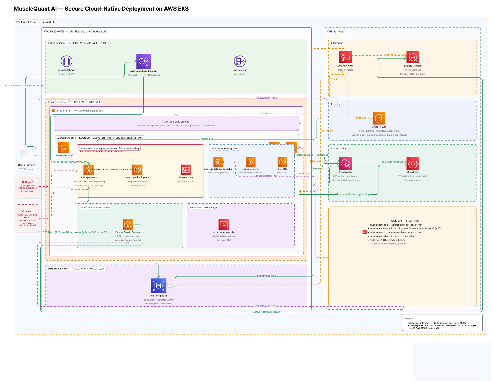
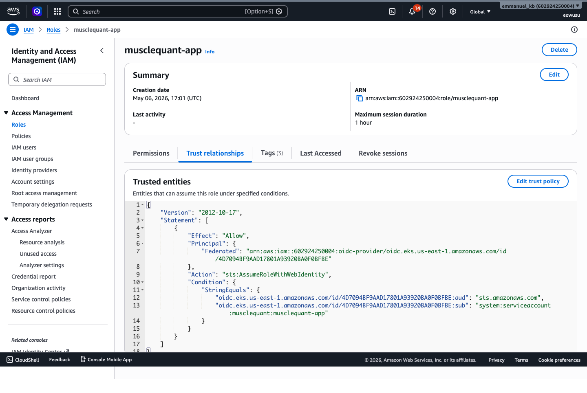
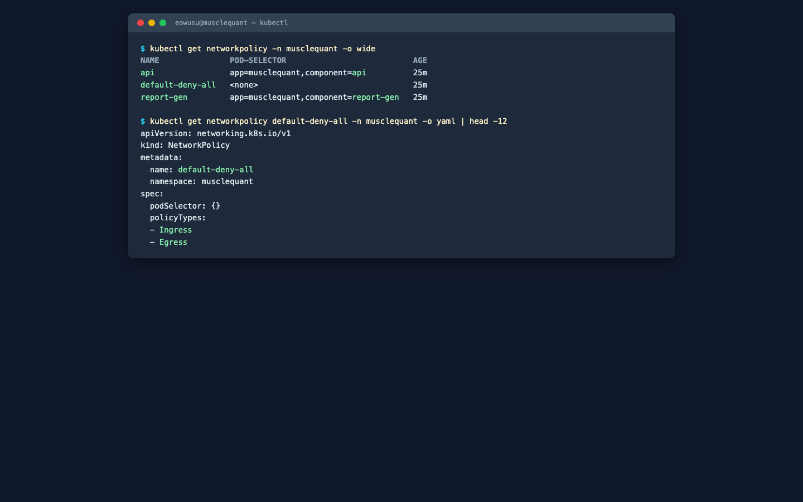
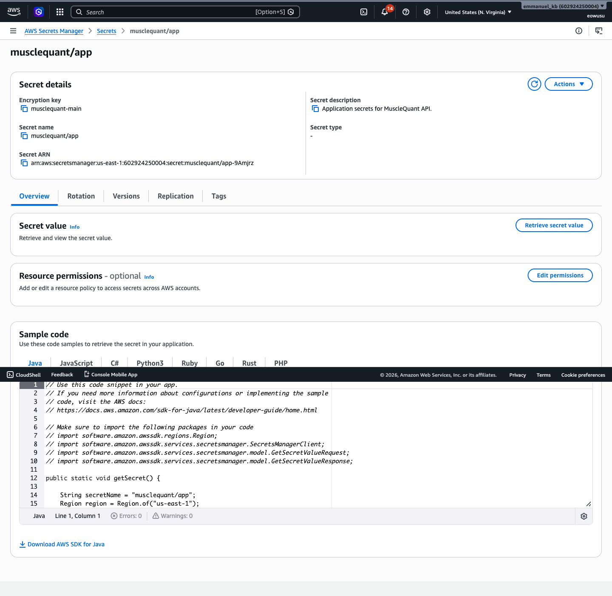
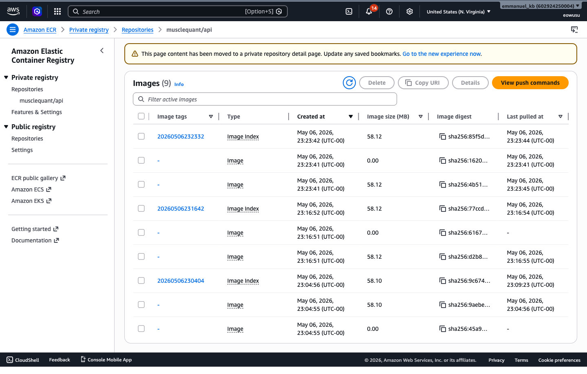
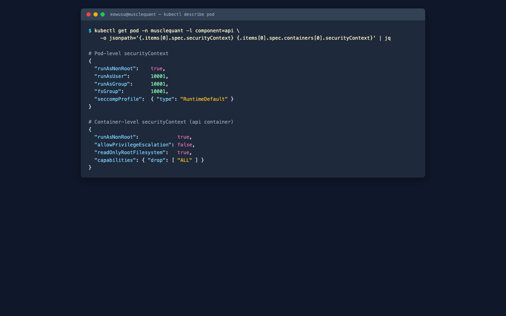
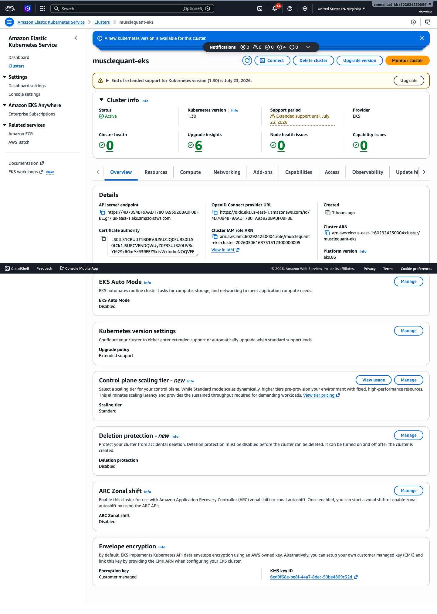
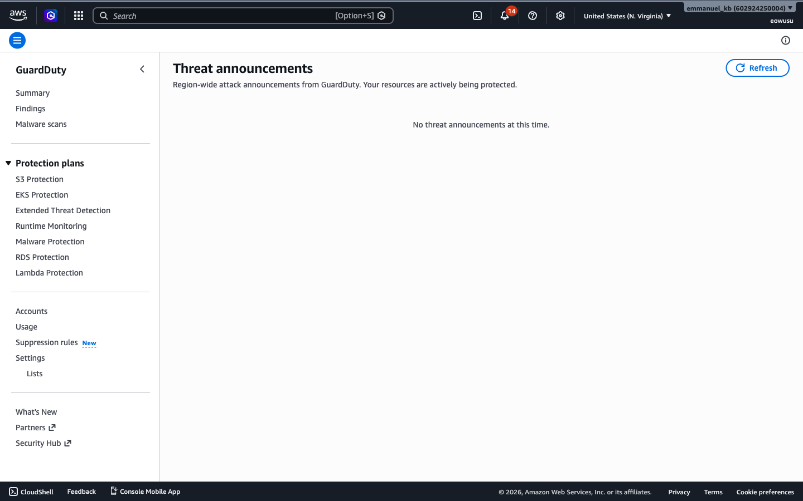
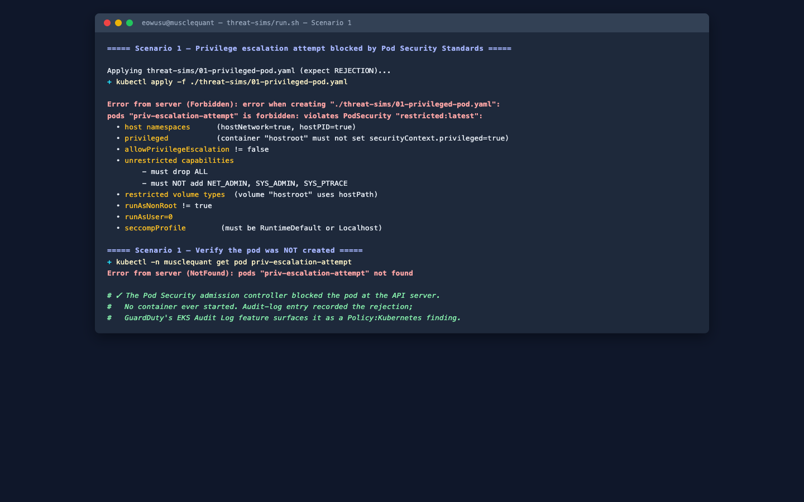
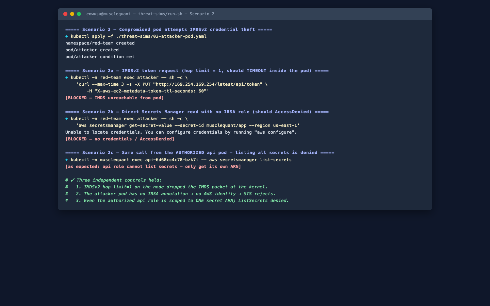

# Secure Cloud-Native Application Deployment on AWS using Kubernetes (EKS)

**Course:** CS581 — Cloud Security Engineering
**Project:** Signature Project
**Application:** MuscleQuant AI — surface EMG monitoring for athletes
**Authors:** Emmanuel Owusu, Gelin Deng

---

## 1. Executive summary

This project puts a two-service Python web application on Amazon EKS and
hardens it the way you would actually have to harden a real fintech workload.
The app is small on purpose: an `api` service that ingests EMG samples and
serves the frontend, and a stateless `report-gen` service that renders
post-session reports. The interesting work is in the platform around it.

The platform pieces, in plain terms:

- Each Kubernetes ServiceAccount has its own IAM role (IRSA), scoped to one
  secret ARN where applicable.
- Pod Security Standards `restricted` is enforced at admission on the
  application namespace.
- NetworkPolicies default to deny; every allowed flow is named.
- The application's DB password lives only in AWS Secrets Manager, encrypted
  with a customer-managed KMS key, and is pulled into the cluster by the
  External Secrets Operator.
- RDS Postgres requires TLS and is reachable only from the EKS node Security
  Group.
- CloudWatch, VPC flow logs, ECR enhanced scanning, and GuardDuty (EKS audit
  log + Runtime Monitoring) cover the detection side.

Two threat simulations exercise these controls end to end. Both are written
to fail: the failure path is the proof that the control works.

## 2. Architecture design and justification



*Figure 1. End-to-end architecture: VPC layout, EKS namespaces, IRSA trust paths, encryption, observability, and the two threat overlays.*

### 2.1 Trust boundaries

There are four trust boundaries in this architecture. The controls in later
sections all hang off them, so it helps to name them first.

1. Internet ↔ VPC. An internet-facing Application Load Balancer in public
   subnets terminates TLS. Nothing else internet-routable lives inside the
   VPC.
2. Public ↔ private subnets. Worker nodes, RDS, and every pod sit in private
   subnets. The only outbound path is through a NAT gateway to the public
   subnets and onward to AWS service endpoints.
3. Cluster ↔ the rest of AWS. Pods have no AWS credentials by default. The
   only IAM-to-Kubernetes bridge is IRSA, scoped per workload.
4. Pod ↔ pod inside the cluster. The `musclequant` namespace defaults to deny
   in both directions, with named-allow rules for the specific flows we want.

### 2.2 VPC layout

The VPC uses a `10.20.0.0/16` block divided into three tiers across two
availability zones:

| Tier | CIDR (per AZ) | Purpose |
|---|---|---|
| Public | `/24` × 2 | NAT gateway, ALB, Internet Gateway egress only |
| Private (workload) | `/24` × 2 | EKS managed nodes; pod IPs allocated from this range by the VPC CNI |
| Database | `/24` × 2 | RDS subnet group; not routable to the internet |

A single NAT gateway is used for cost reasons during the demo. In production
we would deploy one NAT per AZ to avoid the cross-AZ hop on every egress,
which is both a latency tax and an availability single point of failure.
VPC Flow Logs are enabled at the VPC level and written to a CloudWatch log
group with seven-day retention. They give a packet-level record of every
accepted and rejected flow, which is what makes correlating a GuardDuty
finding back to a specific source IP feasible later on.

### 2.3 EKS placement decisions

AWS manages the control plane. The cluster's API endpoint is public for the
demo, because the grader needs to run `kubectl` from a laptop. In a real
production rollout we would set `cluster_endpoint_public_access = false` and
reach the API only from a VPN or bastion. Even with the public toggle on, all
workloads still run in private subnets, and the public CIDR allow-list on the
endpoint can be tightened at any time without touching any manifests.

Worker nodes are a single managed node group of `t3.medium` instances on the
`AL2023_x86_64_STANDARD` AMI. Three node-group settings carry most of the
security weight:

- `http_tokens = required` forces IMDSv2, so credentials cannot be pulled with
  a one-shot GET.
- `http_put_response_hop_limit = 1` drops any packet originating inside a pod
  (hop count 2) before it reaches `169.254.169.254`. This is the single most
  effective node-level control against pod-to-cloud credential theft.
- `block_device_mappings.xvda.encrypted = true` with a customer-managed KMS
  key means a stolen EBS snapshot is useless without the key.

Kubernetes Secrets are envelope-encrypted with the same CMK via
`cluster_encryption_config.resources = ["secrets"]`. That closes the
well-known gap where base64-encoded etcd contents are not, by themselves,
encryption.

### 2.4 Ingress and egress paths

Inbound traffic follows one path: client → Route 53 (in production) → ALB
with TLS 1.2+ → ALB target group → api Service ClusterIP → api pod. The ALB
is created and managed by the AWS Load Balancer Controller, which runs in
`kube-system` with its own IRSA role limited to the permissions in the
managed `AWSLoadBalancerControllerIAMPolicy`.

Pod egress is also constrained:

- DNS to `kube-system/kube-dns` only.
- Postgres on `5432/tcp` to the RDS CIDR only.
- HTTPS `443/tcp` to AWS service endpoints, with a NetworkPolicy that
  excludes `169.254.169.254/32`.
- Everything else is denied.

That gives us two independent denies on IMDS access: a node-level hop limit
and a namespace-level egress filter. If a careless operator misconfigures one
of them, the other still holds.

### 2.5 Microservices split

The application is split into two services on purpose. The brief asks for a
"microservices-based" deployment, and the split also gives the architecture
something to say about east-west traffic. The `api` service owns auth, the
EMG ingest endpoints, the database connection, and the frontend templates.
The `report-gen` service is stateless and only renders HTML reports from a
JSON payload. They talk over a ClusterIP Service on port 8081, governed by a
directional NetworkPolicy that allows api → report-gen and rejects everything
else.

The split has a security payoff too. `report-gen` has no database
credentials, no AWS identity, and no internet egress beyond DNS. If a
malicious template input ever compromised it, the attacker would end up with
a pod that can render HTML and not much more.

## 3. Security controls implemented

The controls below map directly to the nine project phases in the assignment
brief. Every control has a code reference so the controls can be re-verified
without ambiguity.

### 3.1 Identity and access management (Phase 4)

The EKS cluster authenticates in `API_AND_CONFIG_MAP` mode, so we get IAM-as-RBAC
bindings via the new EKS access-entries API alongside the legacy aws-auth
ConfigMap. The Terraform principal running the apply is granted `cluster-admin`
automatically by the EKS module
(`enable_cluster_creator_admin_permissions = true`). No other identity has
admin by default.

Three IRSA roles are defined in `infra/terraform/iam-irsa.tf`, each bound to
one specific Kubernetes ServiceAccount via OIDC:

| Role | ServiceAccount | Permissions |
|---|---|---|
| `musclequant-app` | `musclequant/musclequant-app` | `secretsmanager:GetSecretValue` on a single secret ARN, `kms:Decrypt` on the project CMK. Nothing else. |
| `musclequant-eso` | `external-secrets/external-secrets` | `secretsmanager:GetSecretValue`, `DescribeSecret`, `ListSecrets` on the `musclequant/*` prefix only. |
| `musclequant-lbc` | `kube-system/aws-load-balancer-controller` | The official `AWSLoadBalancerControllerIAMPolicy` document. |

The point of doing it this way is to push least privilege down to the
ServiceAccount, not just the human user. The api workload's IAM identity
cannot list secrets, cannot read other tenants' secrets, cannot decrypt
arbitrary KMS-encrypted material, and cannot assume any other role. If the
api container ever gets RCE'd, the blast radius in AWS is exactly one
secret.

The Kubernetes side is similarly narrow. The app's Role
(`infra/k8s/02-rbac.yaml`) gives read-only access to ConfigMaps, Secrets, and
Pods inside its own namespace. No cluster-scoped permissions, no write access
to anything.



*Figure 2. The `musclequant-app` IAM role's trust policy. The `StringEquals` condition pins the role to `system:serviceaccount:musclequant:musclequant-app` — no other workload, in any namespace, can assume this role even with a valid OIDC token.*

### 3.2 Network security (Phase 5)

Three layers of controls overlap in the network plane:

1. Security Groups. The RDS Security Group in `infra/terraform/rds.tf` accepts
   ingress on 5432 only from the EKS node Security Group, by ID rather than
   by CIDR. SG-by-ID is intentionally tighter: it stays correct if the node
   CIDR changes, and it cannot be bypassed by spinning up a non-EKS instance
   in the same CIDR.
2. Network ACLs. The VPC module creates default NACLs that allow VPC-local
   traffic and rely on Security Groups for stateful filtering. We route
   public-to-private flows through the ALB only.
3. Kubernetes NetworkPolicies. The `musclequant` namespace has a default-deny
   policy plus two named-allow policies, one per workload. The key clauses:
   - api egress allows report-gen on 8081, DNS to kube-system, RDS by CIDR
     on 5432, and AWS endpoints on 443. It excludes `169.254.169.254/32`.
   - report-gen ingress only allows api pods, and its egress is DNS only.

NetworkPolicy enforcement requires a CNI that implements them. In Amazon EKS
this is the VPC CNI with `ENABLE_NETWORK_POLICY=true`, which is the default
in cluster versions ≥ 1.30 with the `vpc-cni` add-on at a recent revision.



*Figure 3. `kubectl get networkpolicy -n musclequant -o wide` showing the default-deny policy plus the two named-allow policies.*

### 3.3 Data security (Phase 6)

A single customer-managed KMS key with annual rotation handles encryption at
rest across:

- EKS Secret envelope encryption (`cluster_encryption_config`).
- EBS volumes attached to worker nodes (`block_device_mappings.encrypted`).
- RDS storage (`storage_encrypted = true`, `kms_key_id`).
- Secrets Manager (`kms_key_id` on the secret).
- ECR image layers (`encryption_configuration.encryption_type = KMS`).
- CloudWatch log groups for the EKS control plane (`cloudwatch_log_group_kms_key_id`).

Funneling everything through one CMK keeps the audit story straightforward.
The key policy plus the CloudTrail decrypt log describe, between them,
everywhere the encryption boundary actually crosses.



*Figure 4. The `musclequant/app` secret in AWS Secrets Manager, encrypted with the project CMK (`alias/musclequant-main`).*

For data in transit, RDS enforces TLS through the `rds.force_ssl=1`
parameter, and the SQLAlchemy URL emitted into Secrets Manager already
includes `sslmode=require`, so a misconfigured client cannot quietly fall
back to plaintext. Cluster-internal traffic between api and report-gen runs
over HTTP for simplicity, but it stays inside the VPC and is constrained by
NetworkPolicy. Public traffic to the ALB is HTTPS-only with an HTTP→HTTPS
redirect at the listener
(`alb.ingress.kubernetes.io/ssl-redirect: '443'`). The certificate is issued
by cert-manager's self-signed Issuer and imported into ACM by
`make tls/import`.

No secret is ever at rest in plaintext, in a Git history, or in an
environment variable that lives outside the cluster. The Terraform-generated
DB password is written only to Secrets Manager, encrypted with the CMK. The
External Secrets Operator pulls it into the cluster on a one-hour refresh
using its IRSA identity, and materializes it as a normal Kubernetes Secret
named `musclequant-app`. The api Deployment then references that Secret via
`valueFrom.secretKeyRef`, so the value never lands on disk inside the pod
beyond the kubelet-managed projected volume.

### 3.4 Container security (Phase 7)

Both Dockerfiles use `python:3.12-slim` as their base and run as an
unprivileged UID 10001. There are no shell tools, no debugger, and no build
chain in the runtime image. The image starts under `gunicorn`, not the Flask
development server, so request handling goes through a known, audited
entrypoint.

Two ECR repositories (`musclequant/api` and `musclequant/report-gen`) are
configured with KMS encryption, `scan_on_push = true`, and registry-level
enhanced (Inspector-backed) scanning with `CONTINUOUS_SCAN`. A lifecycle
policy prunes untagged images after one day and keeps only the last ten
tagged.



*Figure 5. The `musclequant/api` ECR repository with KMS encryption, scan-on-push, and Inspector-backed enhanced scanning.*

At runtime, the `musclequant` namespace is labeled
`pod-security.kubernetes.io/enforce=restricted`. Any pod that violates the
restricted PSS profile is rejected at API-server admission. Each Deployment
also restates the relevant fields explicitly:

```yaml
securityContext:
  runAsNonRoot: true
  runAsUser: 10001
  seccompProfile: { type: RuntimeDefault }
containers:
  - securityContext:
      allowPrivilegeEscalation: false
      readOnlyRootFilesystem: true
      capabilities: { drop: ["ALL"] }
```

Setting these on the pod spec is intentional duplication. If a future
operator removes the namespace label by accident, the workloads do not
silently weaken.



*Figure 6. `kubectl describe pod -n musclequant -l component=api`, securityContext block — non-root, read-only root filesystem, all capabilities dropped.*

### 3.5 Monitoring and logging (Phase 8)

Five log streams converge on CloudWatch:

- EKS control plane (`api`, `audit`, `authenticator`, `controllerManager`,
  `scheduler`), encrypted with the project CMK and retained for seven days.
- VPC flow logs, also retained for seven days.
- RDS Postgres logs (`postgresql`, `upgrade`).
- Container stdout/stderr via the EKS managed logging path.
- ECR enhanced scanning findings through Inspector v2.

GuardDuty is enabled with two features turned on. EKS Audit Log monitoring
subscribes to the audit log stream and runs a managed set of detectors over
it. Runtime Monitoring uses the EKS add-on management option to auto-deploy
the runtime agent cluster-wide.

Between these, we get coverage across the kill chain. Flow logs catch
network-level anomalies. Audit logs catch API-server-level intent like the
attacker's `kubectl apply`. Runtime monitoring catches what the container
actually did. CloudTrail catches the AWS API calls that follow.



*Figure 7. EKS observability tab confirming all five control-plane log types are streaming to CloudWatch.*



*Figure 8. GuardDuty with EKS Audit Logs and Runtime Monitoring both enabled.*

## 4. Threat model and mitigations

### 4.1 Methodology

The system was modeled using STRIDE against the four trust boundaries from
§2.1. Rather than catalogue every theoretical threat, we focused on the
realistic ones for an internet-facing Kubernetes workload on AWS, and asked
two questions for each: which control closes this, and how would we know if
someone tried? The catalogue below is the answer.

### 4.2 Threat catalogue

| # | Threat (STRIDE) | Mitigating controls | Detection |
|---|---|---|---|
| T1 | **Privilege escalation in-cluster (E)**: attacker with `create pods` schedules a privileged pod that mounts the host filesystem. | Namespace labeled PSS=restricted (admission-time deny). Per-pod `securityContext` re-asserts runAsNonRoot, ROFS, drop ALL caps. | EKS audit log shows the rejected `create pods` request with the violation list; GuardDuty surfaces `Policy:Kubernetes/...` findings. |
| T2 | **Cloud credential theft via IMDS (I)**: compromised pod tries to fetch the EC2 instance role's credentials. | IMDSv2 enforced, hop-limit = 1, NetworkPolicy egress excludes 169.254.169.254/32. Pod has no IAM identity unless it has IRSA. | Curl call timeouts in pod logs; VPC flow logs show the dropped attempt. |
| T3 | **Lateral movement between pods (T)**: a compromised api pod tries to reach an unrelated workload or namespace. | Default-deny NetworkPolicy in the namespace; specific-allow rules naming counterparties by label. | NetworkPolicy denies are not logged by default; we rely on flow logs at the VPC level + GuardDuty runtime monitoring inside the cluster. |
| T4 | **Secret exfiltration (I)**: attacker with read access to a pod tries to read all application secrets. | IRSA on the api SA limits AWS API access to one secret ARN. ESO IRSA limits prefix to `musclequant/*`. K8s RBAC limits the in-cluster Secret reads to the same namespace. | CloudTrail logs the AccessDenied; GuardDuty raises a finding if the call pattern is anomalous. |
| T5 | **Supply-chain compromise via container image (T)**: malicious dependency in a base image. | `python:3.12-slim` + `pip install --no-cache-dir`; ECR enhanced scanning continuous; KMS-encrypted layers; image tag pinned per deploy. | Inspector findings → EventBridge → ECR repo finding events. |
| T6 | **Database compromise via direct network access (S)**: attacker with VPC ingress reaches RDS. | RDS in database subnet (no IGW route); SG ingress allows only the EKS node SG; `rds.force_ssl=1`; password rotated by Terraform on each apply. | RDS logs forwarded to CloudWatch; failed-auth bursts visible through CloudWatch metric filters. |
| T7 | **Public exposure of the cluster API (S)**: attacker scans the internet for EKS API endpoints. | Endpoint is public for the demo, but it still requires a valid IAM identity to authenticate. RBAC limits what each identity can do once authenticated. Production setting flips the public toggle off. | EKS audit log records all calls; CloudTrail records IAM `AssumeRole` attempts. |
| T8 | **Logging tamper (R)**: attacker tries to delete or modify CloudWatch logs to cover tracks. | CloudWatch log groups in this project are encrypted with the project CMK; the IAM roles at runtime do not have `logs:DeleteLogGroup` or `kms:ScheduleKeyDeletion`. | CloudTrail records any `logs:Delete*` call. |

### 4.3 Scenario walkthroughs

Both scenarios are scripted in `threat-sims/run.sh` and produce a transcript
in `docs/threat-sim-output.txt` that the demo video can quote directly. Both
are meant to fail. The failure path is what proves the control works.



*Figure 9. `kubectl apply -f 01-privileged-pod.yaml` rejected at admission with the full PSS violation list.*

Scenario A: privilege escalation (T1). We craft a manifest
(`threat-sims/01-privileged-pod.yaml`) that turns on `hostPID`,
`hostNetwork`, and `privileged: true`, mounts `/` from the host, and adds
the `SYS_ADMIN`, `NET_ADMIN`, and `SYS_PTRACE` capabilities. Running
`kubectl apply` against it returns a Forbidden error from the API server, with
the full violation list quoted ("violates PodSecurity 'restricted:latest':
hostNetwork=true, hostPID=true, hostPath volumes, privileged…"). No
container ever starts. The detection signal is the `kubectl` exit code, the
audit-log entry for the rejected request, and any subsequent GuardDuty
`Policy:Kubernetes` finding.

Scenario B: credential theft via IMDS (T2 + T4). We deploy an
`amazon/aws-cli` pod into a separate `red-team` namespace with the more
permissive `baseline` PSS profile so it starts. From inside that pod, we try
three escalations:

1. `curl -X PUT http://169.254.169.254/latest/api/token`. Times out. The IMDS
   hop-limit on the node drops the packet before it ever leaves the instance.
2. `aws secretsmanager get-secret-value --secret-id musclequant/app`. Fails
   with `Unable to locate credentials` or `AccessDenied`, because the pod has
   no IRSA annotation, so it has no AWS identity at all.
3. From the authorized api pod, `aws secretsmanager list-secrets`. Fails,
   because the api IRSA role only has `GetSecretValue` on a single ARN.

Each step prints `[BLOCKED]` to the transcript on failure. CloudTrail records
the `AccessDenied` attempts. Once GuardDuty has a baseline, it surfaces them
as anomalous runtime activity.



*Figure 10. Threat-sim Scenario B: IMDSv2 token request times out (hop limit), and a credential-less Secrets Manager call returns AccessDenied.*

## 5. Lessons learned

Defense in depth pays off the moment a single control regresses. The IMDS
hop-limit alone would block Scenario B. The NetworkPolicy alone would also
block Scenario B. Either one regressing accidentally leaves the system safe,
and the cost of layering them is roughly one line of HCL each.

IRSA scope, not IAM role count, is the useful unit when reviewing IAM. The
lazy choice would have been one shared role across many ServiceAccounts.
Instead, the IRSA module is invoked three times, each role's policy document
one or two statements long. The audit story becomes "this one secret is read
by exactly one role, assumed by exactly one ServiceAccount, in exactly one
namespace" — verifiable in a minute.

The cost knobs in this Terraform are deliberately visible.
`single_nat_gateway`, `multi_az = false` on RDS, `db.t3.micro`, and a single
managed node group keep the demo cluster under a dollar an hour. Every one
would flip in production. They are passed as named arguments to the module
calls rather than buried in defaults, so the next operator can see the
cost-versus-safety trade in one place. Tear-down matters too:
`recovery_window_in_days = 0` on the secret is intentional, so a forgotten
secret can't keep a recovery window open and block the next `terraform
apply`.

## 6. Appendix A — Compliance mapping

The table below maps each control to the relevant NIST SP 800-53 Rev. 5
control families and the CIS Amazon EKS Benchmark v1.5. The mapping is
intentionally narrow: one control per row, no double-counting.

| Control implemented | NIST 800-53 | CIS EKS Benchmark | Where in repo |
|---|---|---|---|
| IRSA per ServiceAccount, scoped to one ARN | AC-2, AC-6, IA-5 | 3.1.1, 4.1.5 | `infra/terraform/iam-irsa.tf` |
| Kubernetes RBAC, namespace-scoped read-only | AC-3, AC-6 | 4.1.1, 4.1.3 | `infra/k8s/02-rbac.yaml` |
| Pod Security Standards `restricted` enforced | CM-7, SI-3 | 5.2.1–5.2.9 | `infra/k8s/00-namespace.yaml` |
| Default-deny NetworkPolicy + named allow | SC-7, AC-4 | 5.3.2 | `infra/k8s/11-networkpolicy.yaml` |
| IMDSv2 + hop-limit = 1 | AC-3, SC-7 | 3.1.4 | `infra/terraform/eks.tf` |
| KMS CMK envelope encryption (EKS Secrets, EBS, RDS, Secrets Manager, ECR, CloudWatch) | SC-12, SC-13, SC-28 | 5.4.1, 5.4.2 | `infra/terraform/kms.tf` |
| TLS in transit (RDS `force_ssl`, ALB HTTPS) | SC-8, SC-13 | 1.2.x, 5.4.2 | `infra/terraform/rds.tf`, `infra/k8s/10-ingress.yaml` |
| ECR scan-on-push + Inspector enhanced scanning | RA-5, SI-2 | 5.1.1 | `infra/terraform/ecr.tf` |
| Non-root container, read-only root FS, drop ALL caps | CM-7, SI-3 | 5.2.x | `services/*/Dockerfile`, `infra/k8s/07-*`, `08-*` |
| EKS audit + control-plane logs to CloudWatch | AU-2, AU-3, AU-9 | 2.1.1 | `infra/terraform/eks.tf` |
| VPC Flow Logs | AU-2, SC-7 | — | `infra/terraform/vpc.tf` |
| GuardDuty (EKS Audit + Runtime Monitoring) | SI-4, IR-4 | — | `infra/terraform/guardduty.tf` |
| Secrets Manager, never plaintext on disk | SC-12, SC-28 | 5.4.1 | `infra/terraform/secrets.tf` + ESO |
| Customer-managed key rotation enabled | SC-12 | — | `infra/terraform/kms.tf` |
| Terraform-managed infrastructure (drift-detectable) | CM-2, CM-6 | — | `infra/terraform/` |

The mapping is not a substitute for an audit. It is a navigation aid that
shows a reviewer where each rubric item is implemented in a single line.

## 7. Appendix B — Cost estimate

Sustained-running cost, on-demand, `us-east-1`, no Reserved or Savings Plan
discounts. Numbers from the AWS Pricing Calculator, May 2026.

| Component | Spec | Hourly | Monthly (730 hr) |
|---|---|---|---|
| EKS control plane | 1 cluster | $0.10 | $73.00 |
| EC2 worker nodes | 2 × t3.medium on-demand | $0.0832 | $60.74 |
| EBS gp3 volumes | 2 × 30 GB | $0.0066 | $4.80 |
| RDS Postgres | db.t3.micro single-AZ + 20 GB gp3 | $0.0202 | $14.74 |
| NAT Gateway | 1 gateway, ~5 GB/day egress | $0.052 | $37.96 |
| ALB | 1 + ~10 LCUs | $0.0335 | $24.46 |
| Secrets Manager | 1 secret + 1k API calls/mo | — | $0.42 |
| ECR storage | ~2 GB layers | — | $0.20 |
| KMS CMK | 1 key + ~10k requests/mo | — | $1.03 |
| GuardDuty | EKS Audit + Runtime Monitoring | — | ~$5.00 |
| CloudWatch Logs | 7-day retention, ~3 GB ingest | — | $1.50 |
| **Total** | | **~$0.31/hr** | **~$224/mo** |

For the demo, `make up` and `make down` bracket roughly 90 minutes including
recording time, so the actual run-cost is **under $1 USD**.

The numbers above are *running* cost. KMS deletion is windowed (7-day
default), so destroying then re-creating the same key inside that window
costs nothing extra. The Secrets Manager secret in this Terraform sets
`recovery_window_in_days = 0` so it is removable immediately.

## 8. Appendix C — What we'd add for production

The current Terraform is a working defense-in-depth template, but a real
production rollout would also include:

1. **Private API endpoint.** Flip `cluster_endpoint_public_access = false`
   and reach the cluster only through a Session Manager bastion or VPN.
2. **Per-AZ NAT gateways** (`single_nat_gateway = false`,
   `one_nat_gateway_per_az = true`) so a single AZ failure does not blackhole
   pod egress.
3. **Multi-AZ RDS** with `backup_retention_period = 14` and snapshots replicated to a
   second region.
4. **ACM-managed real cert** against a Route 53 hosted zone, not the
   self-signed Issuer.
5. **AWS WAF** on the ALB with the AWS managed core rule set + a SQLi rule
   group, and a rate-based rule for credential-stuffing.
6. **CI shift-left**: `tfsec`, `checkov`, and `kube-linter` running in GitHub
   Actions on every PR; image build in GitHub Actions with image signing
   (`cosign`) and admission-time signature verification (`policy-controller`
   or `connaisseur`).
7. **External Secrets refresh on rotation**, paired with Secrets Manager
   rotation Lambda for the DB password every 30 days.
8. **Centralized log destination** (Security Hub or a SIEM such as Splunk)
   instead of CloudWatch alone.
9. **Backup vault** for RDS automated snapshots + EBS snapshots, with vault
   lock and a separate KMS key.
10. **Disaster-recovery runbook**: documented RTO/RPO targets, a tested
    region-failover procedure, and a cross-region read replica for RDS.
